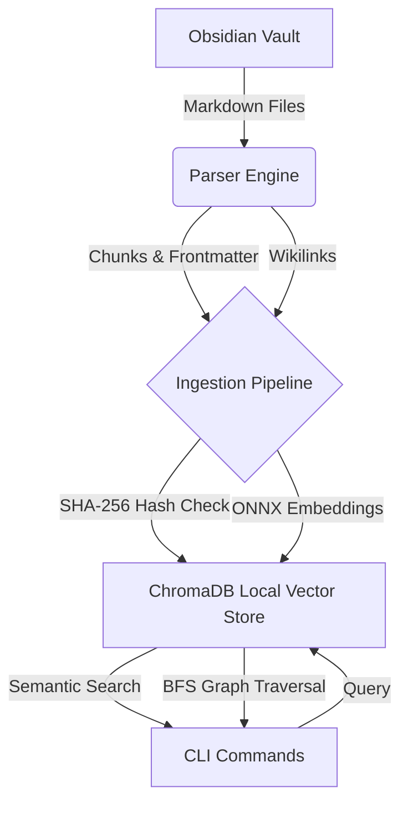

# NoteBrain CLI

NoteBrain is a high-performance Go CLI tool designed to index an Obsidian vault into a local **ChromaDB** vector database. It enables powerful semantic search, backlink traversal, graph connections, hidden connections, shared tags discovery, and graph-boosted semantic queries across your personal knowledge base.

[](https://github.com/nmdra/notebrain-cli/actions/workflows/release.yml)
[](https://pkg.go.dev/github.com/nmdra/notebrain-cli)
[](https://github.com/nmdra/notebrain-cli/blob/main/LICENSE)
[](https://github.com/nmdra/notebrain-cli/releases)
[](https://github.com/nmdra/notebrain-cli/stargazers)

## Features

- **Blazing Fast Ingestion**: Uses Go concurrency and local ONNX embedding models to index your Markdown files rapidly.
- **Embedded ChromaDB**: Stores vectors directly on disk using `chroma-go` v2 (no external database server required).
- **Semantic Search**: Find notes by meaning, not just keywords.
- **Beautiful TUI Integration**: Enjoy an interactive terminal UI for navigating search results with fuzzy-finding and live ingestion progress bars powered by `charm.land/bubbles`.
- **Goldmark AST-Aware Chunking**: Intelligently chunks markdown sections according to header hierarchies instead of arbitrary character splits, preserving code blocks and structural metadata.
- **Advanced Filtering**: Use `--section`, `--has-code`, and `--has-tasks` to filter searches precisely by document structures.
- **Machine-Readable Outputs & AI Agent Chaining**: Supports structured `snake_case` JSON, TSV, and NDJSON with `--format` flags. Integrated `--jsonpath` filtering allows direct scalar extraction without external dependencies like `jq` for effortless command pipelines.
- **Complete Note Retrieval**: Reconstruct full note content on the fly from indexed document chunks (`notebrain get`).
- **Tag Search & Filtering**: Filter vector similarity searches by tag (`--tag`) or inspect structured tag arrays across your notes.
- **OSC 8 Terminal Hyperlinks**: Automatically renders clickable `obsidian://open` links right in your CLI for seamlessly opening matched chunks inside Obsidian (supported terminals only).
- **External Editor Integration**: Launch your preferred terminal/GUI editor (`$EDITOR` environment variable) directly from the TUI results view.
- **Obsidian Excluded Files & Attachments**: Automatically honors your Obsidian configuration (`userIgnoreFilters` and `attachmentFolderPath`) during ingestion to keep databases clean.
- **Graph Traversal**: Explores your Obsidian wikilinks graph (`[[Note]]`).
- **Hidden Connections**: Discovers notes that are semantically identical but not explicitly linked.
- **Graph-Boosted Search**: Combines semantic search scores with structural graph proximities.

## Configuration

NoteBrain uses a dedicated TOML file for persisting CLI arguments and configuration settings.

### TOML Configuration (`~/.notebrain/config/config.toml`)

You can persistently set any global CLI flag using a TOML file (either at `~/.notebrain/config/config.toml` or by passing `--config=/path/to/config.toml`). Copy [config.example.toml](./config.example.toml) to get started:

```toml
# The absolute path to your Obsidian vault on disk
vault-path = "/path/to/Second Brain 2.0"

# The display name of your Obsidian vault (used for obsidian:// URIs)
vault-name = "Second Brain 2.0"

# Default output format ("text", "json", "tsv", "ndjson")
format = "text"
verbose = false

# Number of adjacent chunks (±N) to fetch around each match for surrounding context
context-window = 1

# Respect Obsidian settings (default: true)
respect-exclude = true

# Use $EDITOR as default opener instead of Obsidian (default: false)
use-editor = false
```

## Quick Start

1. **Install** NoteBrain (see [Installation](wiki/Installation.md)).
2. **Ingest** your vault:
   ```bash
   notebrain ingest --vault-path "/path/to/your/Obsidian Vault"
   ```
3. **Search** your thoughts:
   ```bash
   notebrain search "how do message brokers work?" --limit 5
   ```
4. **Retrieve** full note content or chain commands for AI agents:
   ```bash
   # Extract top matching note slug directly into a shell variable
   SLUG=$(notebrain search "message broker" --limit 1 --jsonpath="$.results[0].note_slug")

   # Retrieve complete reconstructed note text
   notebrain get "$SLUG" --jsonpath="$.text"
   ```
5. **Automate** background ingestion:
   - Configure a 3-hour cron job or OS timer so your index stays automatically updated (see [Scheduled Ingestion](wiki/Scheduled_Ingestion.md)).

## Architecture



## Documentation

Comprehensive documentation is available in the `wiki/` directory:

- [Installation Guide](wiki/Installation.md)
- [Architecture Details](wiki/Architecture.md)

### CLI Command Reference

Full documentation for all NoteBrain commands:

- [Commands Reference](wiki/Commands.md)

## License

MIT License
