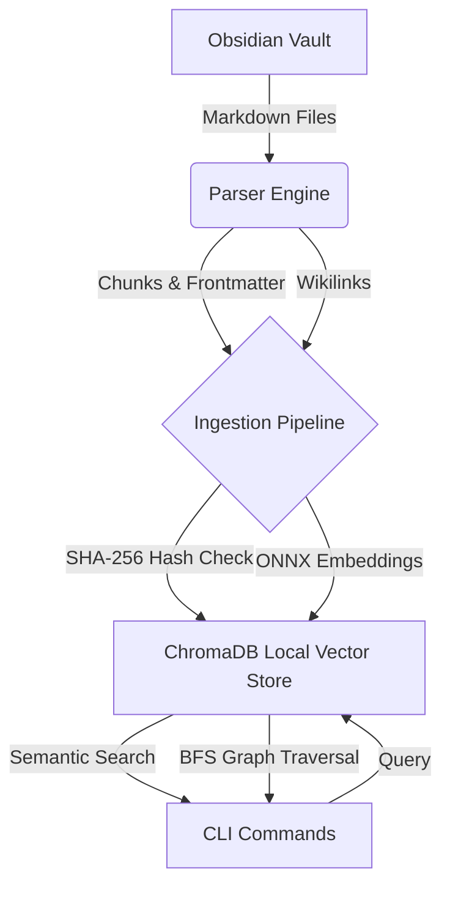

# NoteBrain CLI

NoteBrain is a high-performance Go CLI tool designed to index an Obsidian vault into a local **ChromaDB** vector database. It enables powerful semantic search, backlink traversal, graph connections, hidden connections, shared tags discovery, and graph-boosted semantic queries across your personal knowledge base.

[](https://github.com/nmdra/notebrain-cli/actions/workflows/release.yml)

## Features

- **Blazing Fast Ingestion**: Uses Go concurrency and local ONNX embedding models to index your Markdown files rapidly.
- **Embedded ChromaDB**: Stores vectors directly on disk using `chroma-go` v2 (no external database server required).
- **Semantic Search**: Find notes by meaning, not just keywords.
- **Graph Traversal**: Explores your Obsidian wikilinks graph (`[[Note]]`).
- **Hidden Connections**: Discovers notes that are semantically identical but not explicitly linked.
- **Graph-Boosted Search**: Combines semantic search scores with structural graph proximities.

## Quick Start

1. **Install** NoteBrain (see [Installation](wiki/Installation.md)).
2. **Ingest** your vault:
   ```bash
   notebrain ingest --vault "/path/to/your/Obsidian Vault"
   ```
3. **Search** your thoughts:
   ```bash
   notebrain search "how do message brokers work?" --limit 5
   ```

## Architecture



## Documentation

Comprehensive documentation is available in the `wiki/` directory:
- [Installation Guide](wiki/Installation.md)
- [Architecture Details](wiki/Architecture.md)

### CLI Command Reference
Full auto-generated documentation for the CLI commands:
- [notebrain](docs/cli/notebrain.md)
- [notebrain ingest](docs/cli/notebrain_ingest.md)
- [notebrain search](docs/cli/notebrain_search.md)
- [notebrain backlinks](docs/cli/notebrain_backlinks.md)
- [notebrain connections](docs/cli/notebrain_connections.md)
- [notebrain hidden](docs/cli/notebrain_hidden.md)
- [notebrain tags](docs/cli/notebrain_tags.md)
- [notebrain boosted](docs/cli/notebrain_boosted.md)

## License
MIT License
