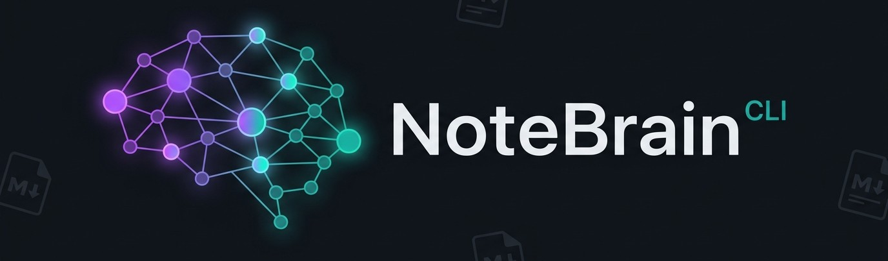
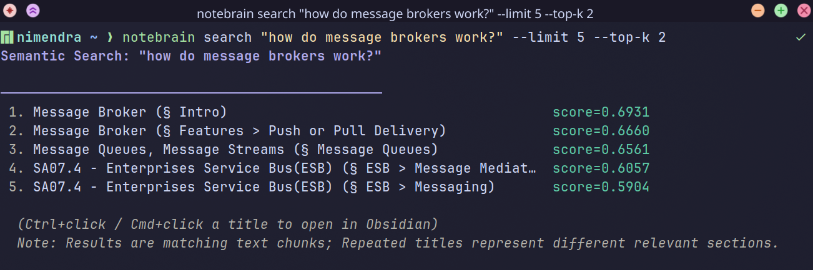
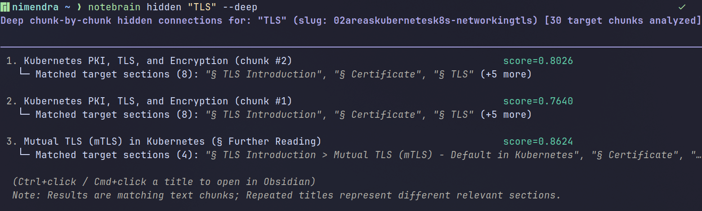
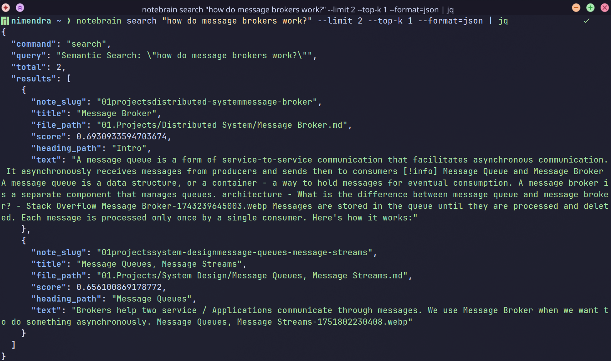

# NoteBrain CLI

A Go CLI tool that turns your [Obsidian](https://obsidian.md/) vault into a fully offline knowledge backend for **AI coding agents**. NoteBrain indexes markdown notes into a local **[ChromaDB](https://www.trychroma.com/)** vector database and exposes semantic search, wikilink graph traversal, and hidden connection discovery through structured output — designed to be chained directly by autonomous agents, shell pipelines, and LLM tool-use workflows.

Ships with an [AI agent skill](wiki/Skill_Usage.md) for integration with Agents like [Google Antigravity](https://antigravity.google/), [Pi agent](https://pi.dev) and Claude Code.This skill is specially optimized to reduce token usage and latency.

[](https://github.com/nmdra/notebrain-cli/actions/workflows/release.yml)
[](https://pkg.go.dev/github.com/nmdra/notebrain-cli/v2)
[](https://deepwiki.com/nmdra/notebrain-cli)
[](https://github.com/nmdra/notebrain-cli/blob/master/go.mod)
[](https://github.com/nmdra/notebrain-cli/blob/main/LICENSE)
[](https://github.com/nmdra/notebrain-cli/releases)
[](https://github.com/nmdra/notebrain-cli/stargazers)

<p align="center">
  
</p>

> [!NOTE]
> **Hi, I'm [Nimendra](https://nimendra.xyz).**  
> I use [Obsidian](https://obsidian.md/) daily as my primary note-taking solution. When AI agents emerged, I wanted to use my Obsidian vault as an RAG system.But most existing solutions don't fulfill my requirements.  
> While researching, I came across [this article](https://motherduck.com/blog/obsidian-rag-duckdb-motherduck/), which inspired this project.So I built this for my personal use. While you can use it directly, I highly encourage you to fork and modify this solution for your own use case.
>
> > _I don't use Windows or macOS, so those versions aren't shipped directly, but you can compile the binary using the source code._

## Prerequisites

- **Go 1.26.4+**
- **CGO-enabled toolchain**
- Linux (macOS and Windows binaries are untested)

## Features

- **Semantic Search** — Find notes by meaning, not just keywords. Uses the [`all-MiniLM-L6-v2`](https://huggingface.co/sentence-transformers/all-MiniLM-L6-v2) ONNX model for fully offline inference.
- **Multi-Query Support** — Search using multiple queries. This enables AI agents to search more accurately by separating searches that contain distinct topics.
- **Graph Traversal** — Walk your Obsidian wikilink graph (`[[Note]]`) via BFS: `backlinks` (canonicalized path resolution), `connections` (multi-hop), `tags` (shared tag neighbors).
- **Hidden Connections** — Discover notes that are semantically similar but not explicitly linked (`notebrain hidden`). Supports `--deep` chunk-by-chunk analysis across sections and `--include-linked` to evaluate semantically related notes that are already linked.
- **Graph-Boosted Search** — Combine semantic similarity scores with structural graph proximity for richer results.
- **Interactive TUI & Guidance** — Navigate search results with fuzzy-finding powered by Bubble Tea, plus intelligent, context-aware empty state hints when terminal queries return zero results.
- **Advanced Filtering** — Narrow searches by `--section`, `--has-code`, `--has-tasks`, or `--tag`.
- **Full Note Retrieval** — Reconstruct complete note content dynamically from indexed chunks (`notebrain get`).
- **Machine-Readable Output** — Structured JSON, TSV via `--format` flags, plus built-in `--jsonpath` extraction (no `jq` needed).
- **AI Agent Skill** — Ships with a built-in AI agent skill (`.agents/skills/notebrain/`) for autonomous knowledge retrieval (see [AI Agent Skill Usage](wiki/Skill_Usage.md)).
- **OSC 8 Hyperlinks** — Clickable `obsidian://open` links directly in your terminal. Works in [alacritty](https://github.com/alacritty/alacritty), [WezTerm](https://wezfurlong.org/wezterm/), [kitty](https://sw.kovidgoyal.net/kitty/) and others supporting the [OSC 8 spec](https://gist.github.com/egmontkob/eb114294efbcd5adb1944c9f3cb5feda).
- **Editor Integration** — Open matched notes in `$EDITOR` or Obsidian directly from the TUI.
- **Obsidian-Aware Ingestion** — Honors `userIgnoreFilters` and `attachmentFolderPath` from your Obsidian config. Optionally skip phantom links and attachment references.

> _Note: Currently, this tool focuses on Markdown text only and does not support PDF or image OCR._

### Under the Hood

- **Goldmark AST-Aware Chunking** — Splits markdown by header hierarchy rather than arbitrary character offsets, strictly preserving lists, GFM tables, blockquotes/callouts, and code blocks.
- **Embedded ChromaDB** — Stores vectors directly on disk via [`chroma-go`](https://github.com/amikos-tech/chroma-go) v0.4.x (no external database server required).
- **Incremental Ingestion** — SHA-256 content hashing skips unmodified notes in milliseconds on re-runs.

> _See the [Architecture](wiki/Architecture.md) guide for more details._

## Installation

Download a pre-built binary from the [GitHub Releases](https://github.com/nmdra/notebrain-cli/releases) page, or build from source:

```bash
git clone https://github.com/nmdra/notebrain-cli.git
cd notebrain-cli
make build          # CGO_ENABLED=1 go build -o notebrain .
sudo mv notebrain /usr/local/bin/
```

See the full [Installation Guide](wiki/Installation.md) for details.

## Quick Start

**1. Index your vault:**

```bash
notebrain ingest --vault-path "/path/to/your/Obsidian Vault"
```

> _Note: First-time indexing may take several minutes depending on your vault size._

**2. Search your notes by meaning:**

```bash
notebrain search "how do message brokers work?" --limit 5 --top-k 2
```

<p align="center">
  
</p>

**3. Discover deep hidden connections across note sections:**

Find notes that share similar concepts without direct wikilinks, using `--deep` chunk-by-chunk section matching (`§ <Heading>`):

```bash
notebrain hidden "TLS" --deep
```

<p align="center">
  
</p>

**4. Get structured output for scripts and AI agents:**

```bash
notebrain search "how do message brokers work?" --limit 2 --top-k 1 --format=json | jq
```

<details>
<summary>Example JSON output</summary>

<p align="center">
  
</p>

</details>

**5. Chain commands to retrieve full notes:**

```bash
# Extract slug from top search result
SLUG=$(notebrain search "message broker" --limit 1 --jsonpath="$.results[0].note_slug")

# Retrieve complete reconstructed note text
notebrain get "$SLUG" --jsonpath="$.text"
```

**6. Automate indexing** with a cron job or systemd timer so your index stays fresh (see [Scheduled Ingestion](wiki/Scheduled_Ingestion.md)).

## Configuration

NoteBrain reads configuration from a TOML file at `~/.notebrain/config/config.toml` (or pass `--config=/path/to/config.toml`). CLI flags always override TOML values.

Copy the template to get started:

```bash
mkdir -p ~/.notebrain/config
cp config.example.toml ~/.notebrain/config/config.toml
```

Key settings ([full reference](./config.example.toml)):

```toml
vault-path = "/path/to/Second Brain 2.0"
vault-name = "Second Brain 2.0"
format     = "text"              # "text", "json", "tsv", "ndjson"

skip-attachments = true          # ignore image/file links in graph
skip-phantom     = true          # exclude uncreated "phantom" notes
respect-exclude  = true          # honor Obsidian's ignore rules
```

### Data Location

All persistent data is stored under `~/.notebrain/`:

| Path                              | Contents                                                 |
| --------------------------------- | -------------------------------------------------------- |
| `~/.notebrain/chroma/`            | ChromaDB vector store (embeddings, metadata, link graph) |
| `~/.notebrain/config/config.toml` | User configuration file                                  |

To fully uninstall, remove the `notebrain` binary and delete `~/.notebrain/`.

## Documentation

| Guide                                                | Description                                                |
| ---------------------------------------------------- | ---------------------------------------------------------- |
| [Installation](wiki/Installation.md)                 | Prerequisites, pre-built binaries, building from source    |
| [Commands Reference](wiki/Commands.md)               | Full CLI command and flag documentation                    |
| [Architecture](wiki/Architecture.md)                 | Internals: chunking pipeline, embedding, ChromaDB schema   |
| [Scheduled Ingestion](wiki/Scheduled_Ingestion.md)   | Cron and systemd timer setup for background indexing       |
| [AI Agent Skill Usage](wiki/Skill_Usage.md)          | Using the built-in AI agent skill for autonomous retrieval |
| [DeepWiki](https://deepwiki.com/nmdra/notebrain-cli) | AI-generated codebase documentation                        |

## Contributing

Contributions are welcome! Please open an issue or pull request on [GitHub](https://github.com/nmdra/notebrain-cli).

This project uses [Conventional Commits](https://www.conventionalcommits.org/), Go vendoring (`vendor/`), and pre-commit hooks via [Lefthook](https://github.com/evilmartians/lefthook).

## License

[MIT License](LICENSE) — Copyright © 2026 nmdra
