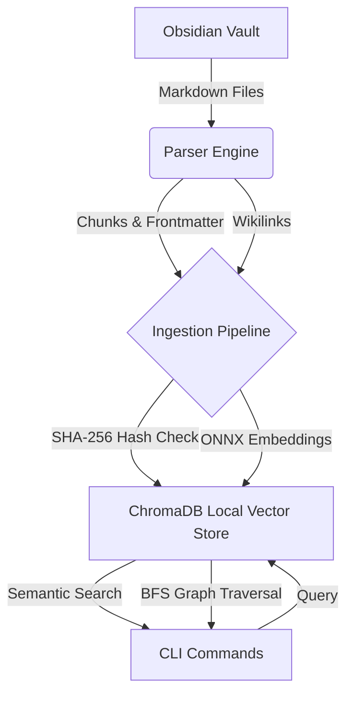

# NoteBrain CLI

NoteBrain is a high-performance Go CLI tool designed to index an Obsidian vault into a local **ChromaDB** vector database. It enables powerful semantic search, backlink traversal, graph connections, hidden connections, shared tags discovery, and graph-boosted semantic queries across your personal knowledge base.

[](https://github.com/nmdra/notebrain-cli/actions/workflows/release.yml)

## Features

- **Blazing Fast Ingestion**: Uses Go concurrency and local ONNX embedding models to index your Markdown files rapidly.
- **Embedded ChromaDB**: Stores vectors directly on disk using `chroma-go` v2 (no external database server required).
- **Semantic Search**: Find notes by meaning, not just keywords.
- **Beautiful TUI Integration**: Enjoy an interactive terminal UI for navigating search results with fuzzy-finding and live ingestion progress bars powered by `charm.land/bubbles`.
- **Goldmark AST-Aware Chunking**: Intelligently chunks markdown sections according to header hierarchies instead of arbitrary character splits, preserving code blocks and structural metadata.
- **Advanced Filtering**: Use `--section`, `--has-code`, and `--has-tasks` to filter searches precisely by document structures.
- **Machine-Readable Outputs**: Supports JSON, TSV, and NDJSON with `--format` flags for seamless integration into AI agent workflows (Claude, Gemini, etc.).
- **OSC 8 Terminal Hyperlinks**: Automatically renders clickable `obsidian://open` links right in your CLI for seamlessly opening matched chunks inside Obsidian (supported terminals only).
- **External Editor Integration**: Launch your preferred terminal/GUI editor (`$EDITOR` environment variable) directly from the TUI results view.
- **Obsidian Excluded Files & Attachments**: Automatically honors your Obsidian configuration (`userIgnoreFilters` and `attachmentFolderPath`) during ingestion to keep databases clean.
- **Graph Traversal**: Explores your Obsidian wikilinks graph (`[[Note]]`).
- **Hidden Connections**: Discovers notes that are semantically identical but not explicitly linked.
- **Graph-Boosted Search**: Combines semantic search scores with structural graph proximities.

## Configuration

NoteBrain supports both `.env` files and a dedicated `config.toml` file for persisting CLI arguments.

### TOML Configuration (`~/.notebrain/config/config.toml`)
You can persistently set any global CLI flag using a TOML file. For example, to avoid typing `--vault-path` and `--format` every time:
```toml
vault-path = "/path/to/Second Brain 2.0"
format = "text"
verbose = false

# Respect Obsidian settings (default: true)
respect-exclude = true

# Use $EDITOR as default opener instead of Obsidian (default: false)
use-editor = false
```

### Environment Variables (`.env`)
You can also manage configuration via environment variables. Copy `.env.example` to `.env` in the project root:

```env
# The absolute path to your Obsidian vault on disk (used by 'ingest')
OBSIDIAN_VAULT_PATH="/path/to/Second Brain 2.0"

# The name of your Obsidian vault (used by 'search' for obsidian:// URIs)
OBSIDIAN_VAULT_NAME="Second Brain 2.0"

# Set to 1 to globally disable OSC 8 terminal hyperlinks in output
# NO_HYPERLINKS=1
```

## Quick Start

1. **Install** NoteBrain (see [Installation](wiki/Installation.md)).
2. **Ingest** your vault:
   ```bash
   notebrain ingest --vault-path "/path/to/your/Obsidian Vault"
   ```
3. **Search** your thoughts:
   ```bash
   notebrain search "how do message brokers work?" --limit 5
   ```

## Architecture



## Documentation

Comprehensive documentation is available in the `wiki/` directory:
- [Installation Guide](wiki/Installation.md)
- [Architecture Details](wiki/Architecture.md)

### CLI Command Reference
Full documentation for all NoteBrain commands:
- [Commands Reference](wiki/Commands.md)

## License
MIT License
