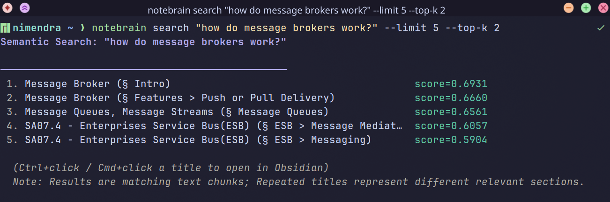
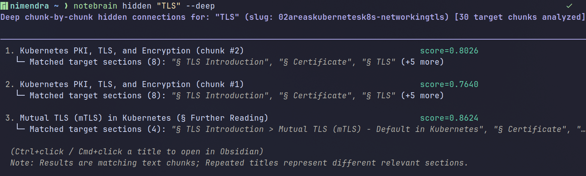
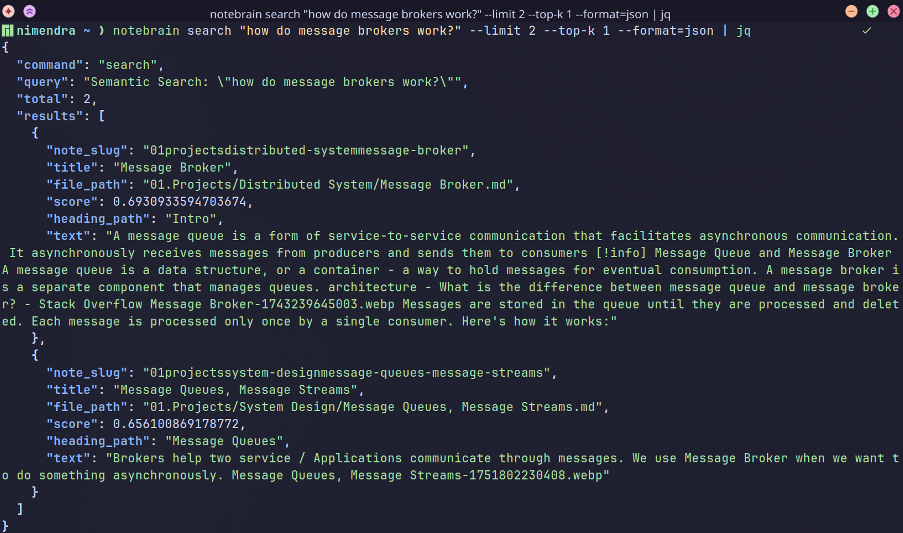

# NoteBrain CLI

NoteBrain is a Go CLI tool. It makes your [Obsidian](https://obsidian.md/) vault a fully offline knowledge backend for AI coding agents. NoteBrain indexes markdown notes and PDFs into a local [ChromaDB](https://www.trychroma.com/) vector database. It provides semantic search, wikilink graph traversal, and hidden connection discovery. It gives structured output. AI agents, shell pipelines, and LLM tool workflows can use this output directly.

NoteBrain includes an [AI agent skill](wiki/Skill_Usage.md) and an [OpenCode Agent Configuration](wiki/OpenCode_Integration.md). You can use them to integrate with autonomous coding agents (for example, [OpenCode](https://opencode.ai), [Pi agent](https://pi.dev), and Claude Code). This setup decreases token usage and latency.

 [](https://github.com/nmdra/notebrain-cli/blob/master/go.mod)
[](https://pkg.go.dev/github.com/nmdra/notebrain-cli/v2)
[](https://github.com/nmdra/notebrain-cli/actions/workflows/release.yml)
[](https://github.com/nmdra/notebrain-cli/releases)
[](https://deepwiki.com/nmdra/notebrain-cli)
[](https://github.com/nmdra/notebrain-cli/blob/main/LICENSE)
[](https://github.com/nmdra/notebrain-cli/stargazers)

<p align="center">
  
</p>

> [!NOTE]
> **Hi, I'm [Nimendra](https://nimendra.xyz).**  
> I use [Obsidian](https://obsidian.md/) daily as my primary note-taking solution. When AI agents emerged, I wanted to use my Obsidian vault as an RAG system.But most existing solutions don't fulfill my requirements.  
> While researching, I came across [this article](https://motherduck.com/blog/obsidian-rag-duckdb-motherduck/), which inspired this project.So I built this for my personal use. While you can use it directly, I highly encourage you to fork and modify this solution for your own use case.
>
> > _I don't use Windows or macOS, so those versions aren't shipped directly, but you can compile the binary using the source code._

## Features

- **Semantic Search**: Find notes by meaning with the offline `all-MiniLM-L6-v2` ONNX embedding model.
- **Multi-Query Search**: Do a search with multiple independent queries. This gives better results for complex topics.
- **Knowledge Graph Traversal**: Examine your Obsidian wikilink graph. Find backlinks, multi-hop connections, and shared tags.
- **Hidden Connections**: Find notes that have a semantic relationship but no explicit links. You can use deep section-level analysis.
- **Graph-Boosted Ranking**: Combine semantic similarity with graph relationships for better search results.
- **Advanced Filtering**: Filter results by sections, tags, code blocks, tasks, and other metadata.
- **Full Note Retrieval**: Get the complete note from the indexed content.
- **Structured Output**: Export results as JSON or TSV. Use built-in JSONPath queries for automation.
- **AI Agent Integration**: NoteBrain has a built-in AI agent skill for autonomous knowledge retrieval.
- **Terminal Hyperlinks**: Use OSC 8 hyperlinks to open notes from supported terminals.
- **Obsidian-Aware Indexing**: NoteBrain obeys your Obsidian configuration. It ignores excluded files and attachment folders.
- **Optional PDF Support**: Get text from PDFs. NoteBrain uses an LLM API to read scanned documents.

### Internals

- **PDF Support**: NoteBrain extracts text from PDFs with **[PDFium-go](https://github.com/klippa-app/go-pdfium)**. It converts the raw text into structured Markdown with an LLM API (OpenRouter or DeepSeek). This makes high-quality chunks that match native markdown notes.
- **Goldmark AST-Aware Chunking**: NoteBrain splits markdown by header hierarchy. It preserves lists, GFM tables, blockquotes, callouts, and code blocks.
- **Embedded ChromaDB**: NoteBrain writes vectors to the disk with [`chroma-go`](https://github.com/amikos-tech/chroma-go).
- **Incremental Ingestion**: NoteBrain calculates SHA-256 content hashes. It ignores unmodified notes in milliseconds during subsequent runs.

> _Read the [Architecture](wiki/Architecture.md) guide for more information._

## Prerequisites

- **Go 1.26.4+** 
- A CGO-enabled toolchain.
- Linux. NoteBrain does not test macOS and Windows binaries.

## Installation

1. Download a pre-built binary from the [GitHub Releases](https://github.com/nmdra/notebrain-cli/releases) page.
2. Or build the binary from the source code:

```bash
git clone https://github.com/nmdra/notebrain-cli.git
cd notebrain-cli
make build          # CGO_ENABLED=1 go build -o notebrain .
sudo mv notebrain /usr/local/bin/
```

Read the [Installation Guide](wiki/Installation.md) for full instructions.

## Quick Start

**1. Initialize your configuration:**

```bash
notebrain init
```

This command starts an interactive wizard. The wizard configures your vault path and PDF settings.

**2. Index your vault:**

```bash
notebrain ingest

# To index PDFs, you must provide an LLM model and an API key (DEEPSEEK_API_KEY, OPENROUTER_API_KEY, etc.):
# OPENROUTER_API_KEY="sk-or-..." notebrain ingest --enable-pdf --llm-model "tencent/hy3"
```

> Note: The first indexing operation takes several minutes. The time depends on your vault size and the quantity of PDFs.

**3. Search your notes by meaning:**

```bash
notebrain search "how do message brokers work?" --limit 5 --top-k 2
# Include PDF results in search:
notebrain search "message broker" --with-pdf
```

<p align="center">
  
</p>

**4. Discover deep hidden connections across note sections:**

Find notes that share concepts but have no direct wikilinks. Use `--deep` for chunk-by-chunk section matching (`§ <Heading>`):

```bash
notebrain hidden "TLS" --deep
```

<p align="center">
  
</p>

**5. Get structured output for scripts and AI agents:**

```bash
notebrain search "how do message brokers work?" --limit 2 --top-k 1 --format=json | jq
```

<details>
<summary>Example JSON output</summary>

<p align="center">
  
</p>

</details>

**6. Chain commands to retrieve full notes:**

```bash
# Extract slug from top search result
SLUG=$(notebrain search "message broker" --limit 1 --jsonpath="$.results[0].note_slug")

# Retrieve complete reconstructed note text
notebrain get "$SLUG" --jsonpath="$.text"
```

**7. Automate indexing:** Set a cron job or systemd timer to keep your index current. Read [Scheduled Ingestion](wiki/Scheduled_Ingestion.md).

**8. Integration with AI Agents:**
Use the built-in [AI agent skill](wiki/Skill_Usage.md) and [OpenCode Agent Configuration](wiki/OpenCode_Integration.md) to retrieve knowledge.

> [!TIP]
> Use the [Pi Agent](wiki/Pi_Agent.md) with the provided skill. The agent gives better results with low-cost models (for example, [DeepSeek V4 Flash](https://www.deepseek.com/), [tencent hy3](https://hy.tencent.com/), or [Gemini Flash 3.6](https://ai.google.dev/gemini-api/docs/flash)). It does not consume unnecessary tokens. It increases cache hit rates and decreases costs.
>
> For LLM models, use the medium or low thinking mode to get fast responses.

[](https://asciinema.org/a/1261133)

## Configuration

NoteBrain uses a TOML file for configuration at `~/.notebrain/config/config.toml`. You can also supply `--config=/path/to/config.toml`. CLI flags always override TOML values.

To start, copy the template:

```bash
mkdir -p ~/.notebrain/config
cp config.example.toml ~/.notebrain/config/config.toml
```

Key configuration values (read the [full reference](./config.example.toml)):

```toml
vault-path = "/path/to/Second-Brain"
vault-name = "Second-Brain"
format     = "text"              # "text", "json", "tsv"

debug           = false         # enable debug logging to stderr
respect-exclude = false         # honor Obsidian's ignore rules
show-tags       = false         # include tag names in output
```

### Data Location

NoteBrain stores persistent data in `~/.notebrain/`:

| Path                              | Contents                                                 |
| --------------------------------- | -------------------------------------------------------- |
| `~/.notebrain/chroma/`            | ChromaDB vector store (embeddings, metadata, link graph) |
| `~/.notebrain/config/config.toml` | User configuration file                                  |

To uninstall NoteBrain completely, remove the `notebrain` binary and delete the `~/.notebrain/` directory.

## Documentation

| Guide                                                      | Description                                                              |
| ---------------------------------------------------------- | ------------------------------------------------------------------------ |
| [Installation](wiki/Installation.md)                       | Prerequisites, pre-built binaries, and compilation commands              |
| [Commands Reference](wiki/Commands.md)                     | Full CLI command and flag information                                    |
| [Architecture](wiki/Architecture.md)                       | Internal functions: chunking pipeline, embeddings, and ChromaDB schema   |
| [Scheduled Ingestion](wiki/Scheduled_Ingestion.md)         | Instructions for cron and systemd timers to index data in the background |
| [AI Agent Skill Usage](wiki/Skill_Usage.md)                | Instructions for the built-in AI agent skill                             |
| [OpenCode Agent Integration](wiki/OpenCode_Integration.md) | Configuration for NoteBrain as an OpenCode AI coding assistant           |
| [DeepWiki](https://deepwiki.com/nmdra/notebrain-cli)       | AI-generated codebase documentation                                      |

## Contributing

We welcome contributions. Open an issue or a pull request on [GitHub](https://github.com/nmdra/notebrain-cli).

This project uses [Conventional Commits](https://www.conventionalcommits.org/), Go vendoring (`vendor/`), and pre-commit hooks via [Lefthook](https://github.com/evilmartians/lefthook).

## License

[MIT License](LICENSE) — Copyright © 2026 nmdra
