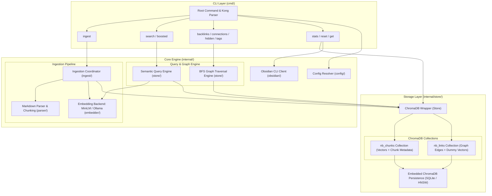

# Architecture & Design

NoteBrain CLI processes your Obsidian markdown vault to create a fully searchable, semantic graph-knowledge engine. It indexes markdown notes into an embedded ChromaDB vector store, enabling semantic search, backlink traversal, graph connections, hidden connections, shared tags discovery, and graph-boosted hybrid search.

---

## 1. System Architecture Diagram

The following diagram illustrates the high-level architecture of NoteBrain CLI, showing the data flow between the CLI layer, core processing engines, embedding providers, and the embedded ChromaDB storage layer.

---

## 2. Local Vector Database (ChromaDB)

NoteBrain embeds [ChromaDB](https://www.trychroma.com/) directly into the Go binary using `chroma-go` v2. NoteBrain runs embedded in your local process (`CGO_ENABLED=1`). SQLite and HNSW bindings are compiled directly into the tool, and the vector storage is flushed synchronously to your disk at `~/.notebrain/chroma`.

---

## 3. ChromaDB Collections & Schema

The data is separated into two primary collections within ChromaDB: `nb_chunks` for content vector search and `nb_links` for graph structure.

### `nb_chunks` Collection

Stores note content chunks along with their vector embeddings and comprehensive structural metadata.

| Property | Value / Setting | Description |
| :--- | :--- | :--- |
| **Collection Name** | `nb_chunks` | Primary collection for note text chunks. |
| **HNSW Space** | `cosine` | Cosine distance metric optimized for semantic text embeddings. |
| **HNSW Index Tuning** | `search_ef=50`, `M=32`, `construction_ef=200`, `num_threads=1` | Tuned to prevent hnswlib background thread crashes and isolated node assertion failures. |
| **Document ID** | `<note_slug>:<chunk_index>` | Unique composite ID (e.g., `my-note:0`, `my-note:1`). |
| **Document Text** | Markdown string | The raw text content of the markdown chunk. |
| **Embedding Vector** | `[]float32` | Dense embedding vector generated by local MiniLM or Ollama models. |

#### Metadata Schema (`nb_chunks`)

To maintain strict compatibility with the Go ChromaDB client, array properties (like tags) are flattened into numbered keys (`tag_0`, `tag_1`, etc.).

| Field Name | Type | Description |
| :--- | :--- | :--- |
| `note_slug` | `string` | Slugified identifier of the parent note. |
| `title` | `string` | Title of the note (from frontmatter or heading/filename). |
| `file_path` | `string` | Relative path to the markdown file within the vault. |
| `chunk_index` | `int` | Zero-based index of the chunk within the note. |
| `word_count` | `int` | Number of whitespace-separated words in the chunk. |
| `has_links` | `bool` | `true` if the chunk contains internal wikilinks or external links. |
| `heading_path` | `string` | Hierarchical heading breadcrumb (e.g., `# Architecture > ## Schema`). |
| `heading_level` | `int` | Numeric depth level of the current section heading. |
| `has_table` | `bool` | `true` if the chunk contains Markdown tables. |
| `has_task` | `bool` | `true` if the chunk contains task checkboxes (`[ ]` or `[x]`). |
| `code_blocks` | `int` | Total count of fenced code blocks within the chunk. |
| `has_code` | `bool` | `true` if `code_blocks > 0`. |
| `modified_ms` | `int` | File last modification timestamp in epoch milliseconds. |
| `content_hash` | `string` | Hash of the chunk content used for deduplication and change tracking. |
| `tag_count` | `int` | Total number of tags associated with the note/chunk. |
| `tag_0`, `tag_1`, ... | `string` | Flat encoding of individual tags (e.g., `tag_0: "golang"`, `tag_1: "ai"`). |

---

### `nb_links` Collection

Stores directed edges representing wikilinks and Markdown links between notes (`source_slug` -> `target_slug`). Because ChromaDB requires all collections to have uniform vector dimensions and non-empty documents, this collection stores dummy vectors.

| Property | Value / Setting | Description |
| :--- | :--- | :--- |
| **Collection Name** | `nb_links` | Metadata-only collection representing the note link graph. |
| **HNSW Space** | `l2` | Euclidean distance (L2 space avoids cosine degeneracy on random vectors). |
| **HNSW Index Tuning** | `num_threads=1` | Single-threaded index operations for stability. |
| **Document ID** | `<source_slug>→<target_slug>` | Unique directed edge ID (e.g., `index→architecture`). |
| **Document Text** | `string` | The link path/string (or `"-"` if empty). |
| **Embedding Vector** | `[]float32` (16-dim) | Dummy 16-dimensional random vector in L2 space to satisfy ChromaDB requirements without causing HNSW index degeneracy. |

#### Metadata Schema (`nb_links`)

| Field Name | Type | Description |
| :--- | :--- | :--- |
| `source_slug` | `string` | Slugified identifier of the source note where the link originates. |
| `target_slug` | `string` | Slugified identifier of the target note being linked to. |
| `target_path` | `string` | Raw link text or path as written in the Markdown source. |
| `display_text` | `string` | Display alias or text of the link (e.g., `[[Target|Alias]]` -> `Alias`). |

---

## 4. Subsystems & Components

- **CLI Layer (`cmd/`)**: Built using [Kong](https://github.com/alecthomas/kong) for command-line parsing and flag resolution. Supports a strict two-tier configuration hierarchy: CLI flags override TOML configuration file (`~/.notebrain/config/config.toml`).
- **Configuration (`internal/configfile` & `config/`)**: Manages TOML configuration loading via Kong resolvers. Supports normalized key lookups (`snake_case` and `kebab-case`) and resolves flags without relying on `.env` files or application environment variables.
- **Embedder (`internal/embedder`)**: Manages the local embedding models. Supports embedded ONNX MiniLM sentence embeddings or external Ollama service backends.
- **Parser (`internal/parser`)**: Reads Markdown files from the Obsidian vault, extracts YAML frontmatter/properties, parses wikilinks and standard Markdown links, identifies task checkboxes and tables, and splits note text into semantic chunks.
- **Ingest (`internal/ingest`)**: Handles multi-worker concurrent directory walking. It reads `.md` files, calls the parser, generates embeddings, and coordinates atomic note updates (`DeleteNoteChunks` -> `UpsertChunks` -> `UpsertLinks` under a single store mutex lock).
- **Store (`internal/store`)**: The ChromaDB wrapper that abstracts collection creation, chunk upsertion, link deduplication, and exposes all graph (BFS traversal in Go) and semantic queries.
- **Obsidian Client (`internal/obsidian`)**: Interacts with the Obsidian CLI for vault operations and note inspection.

---

## 5. Key Architectural Decisions

1. **Embedded Persistent Storage Only**: NoteBrain strictly embeds ChromaDB in persistent mode (`CGO_ENABLED=1`), eliminating the need for a separate Docker container or HTTP vector database server.
2. **Atomic Ingestion Under Mutex**: All note updates are executed under a write lock in the sequence `DeleteNoteChunks` -> `UpsertChunks` -> `UpsertLinks`. This prevents concurrent HNSW graph modifications that could otherwise trigger hnswlib assertion crashes.
3. **In-Memory Graph Traversal**: Graph algorithms (BFS for connections, backlinks, and hidden links) are executed in Go memory over metadata fetched from `nb_links`, rather than relying on complex SQL queries or a dedicated graph database.
4. **Flat Tag Encoding**: Array metadata is flattened (`tag_0`, `tag_1`, ...) to ensure robust compatibility with ChromaDB's Go client binding and querying capabilities.
5. **Dummy 16-Dimensional Vectors for Edges**: Because ChromaDB requires uniform dimensions and non-empty vectors, `nb_links` uses 16-dimensional random float vectors in L2 space. Using 16 distinct dimensions avoids HNSW pathologically failing or corrupting on identical/degenerate vector spaces.
