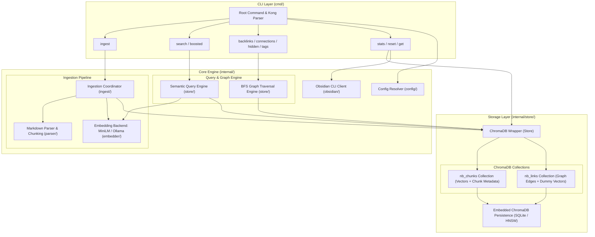

# Architecture & Design

NoteBrain CLI processes your Obsidian markdown vault to create a fully searchable, semantic graph-knowledge engine. It indexes markdown notes into an embedded ChromaDB vector store, enabling semantic search, backlink traversal, graph connections, hidden connections, shared tags discovery, and graph-boosted hybrid search.

---

## 1. System Architecture Diagram

The following diagram illustrates the high-level architecture of NoteBrain CLI, showing the data flow between the CLI layer, core processing engines, embedding providers, and the embedded ChromaDB storage layer.

---

## 2. Local Vector Database (ChromaDB)

NoteBrain embeds [ChromaDB](https://www.trychroma.com/) directly into the Go binary using `chroma-go` v2. NoteBrain runs embedded in your local process (`CGO_ENABLED=1`). SQLite and HNSW bindings are compiled directly into the tool, and the vector storage is flushed synchronously to your disk at `~/.notebrain/chroma`.

---

## 3. ChromaDB Collections & Schema

The data is separated into two primary collections within ChromaDB: `nb_chunks` for content vector search and `nb_links` for graph structure.

### `nb_chunks` Collection

Stores note content chunks along with their vector embeddings and comprehensive structural metadata.

| Property              | Value / Setting                                                | Description                                                                              |
| :-------------------- | :------------------------------------------------------------- | :--------------------------------------------------------------------------------------- |
| **Collection Name**   | `nb_chunks`                                                    | Primary collection for note text chunks.                                                 |
| **HNSW Space**        | `cosine`                                                       | Cosine distance metric optimized for semantic text embeddings.                           |
| **HNSW Index Tuning** | `search_ef=50`, `M=32`, `construction_ef=200`, `num_threads=1` | Tuned to prevent hnswlib background thread crashes and isolated node assertion failures. |
| **Document ID**       | `<note_slug>:<chunk_index>`                                    | Unique composite ID (e.g., `my-note:0`, `my-note:1`).                                    |
| **Document Text**     | Markdown string                                                | The raw text content of the markdown chunk.                                              |
| **Embedding Vector**  | `[]float32`                                                    | Dense embedding vector generated by local MiniLM or Ollama models.                       |

#### Metadata Schema (`nb_chunks`)

To maintain strict compatibility with the Go ChromaDB client, array properties (like tags) are flattened into numbered keys (`tag_0`, `tag_1`, etc.).

| Field Name            | Type     | Description                                                                |
| :-------------------- | :------- | :------------------------------------------------------------------------- |
| `note_slug`           | `string` | Slugified identifier of the parent note.                                   |
| `title`               | `string` | Title of the note (from frontmatter or heading/filename).                  |
| `file_path`           | `string` | Relative path to the markdown file within the vault.                       |
| `chunk_index`         | `int`    | Zero-based index of the chunk within the note.                             |
| `word_count`          | `int`    | Number of whitespace-separated words in the chunk.                         |
| `has_links`           | `bool`   | `true` if the chunk contains internal wikilinks or external links.         |
| `heading_path`        | `string` | Hierarchical heading breadcrumb (e.g., `# Architecture > ## Schema`).      |
| `heading_level`       | `int`    | Numeric depth level of the current section heading.                        |
| `has_table`           | `bool`   | `true` if the chunk contains Markdown tables.                              |
| `has_task`            | `bool`   | `true` if the chunk contains task checkboxes (`[ ]` or `[x]`).             |
| `code_blocks`         | `int`    | Total count of fenced code blocks within the chunk.                        |
| `has_code`            | `bool`   | `true` if `code_blocks > 0`.                                               |
| `modified_ms`         | `int`    | File last modification timestamp in epoch milliseconds.                    |
| `content_hash`        | `string` | Hash of the chunk content used for deduplication and change tracking.      |
| `tag_count`           | `int`    | Total number of tags associated with the note/chunk.                       |
| `tag_0`, `tag_1`, ... | `string` | Flat encoding of individual tags (e.g., `tag_0: "golang"`, `tag_1: "ai"`). |

---

### `nb_links` Collection

Stores directed edges representing wikilinks and Markdown links between notes (`source_slug` -> `target_slug`). Because ChromaDB requires all collections to have uniform vector dimensions and non-empty documents, this collection stores dummy vectors.

| Property              | Value / Setting               | Description                                                                                                            |
| :-------------------- | :---------------------------- | :--------------------------------------------------------------------------------------------------------------------- |
| **Collection Name**   | `nb_links`                    | Metadata-only collection representing the note link graph.                                                             |
| **HNSW Space**        | `l2`                          | Euclidean distance (L2 space avoids cosine degeneracy on random vectors).                                              |
| **HNSW Index Tuning** | `num_threads=1`               | Single-threaded index operations for stability.                                                                        |
| **Document ID**       | `<source_slug>→<target_slug>` | Unique directed edge ID (e.g., `index→architecture`).                                                                  |
| **Document Text**     | `string`                      | The link path/string (or `"-"` if empty).                                                                              |
| **Embedding Vector**  | `[]float32` (16-dim)          | Dummy 16-dimensional random vector in L2 space to satisfy ChromaDB requirements without causing HNSW index degeneracy. |

#### Metadata Schema (`nb_links`)

| Field Name | Type | Description |
| :--- | :--- | :--- |
| `source_slug` | `string` | Slugified identifier of the source note where the link originates. |
| `target_slug` | `string` | Slugified identifier of the target note being linked to. |
| `target_path` | `string` | Raw link text or path as written in the Markdown source. |
| `display_text` | `string` | Display alias or text of the link (e.g., `[[Target|Alias]]` -> `Alias`). |

> [!NOTE]
> **Why does NoteBrain use dummy vectors for links?**
> 
> ChromaDB is architected exclusively as a vector database and lacks support for standard relational tables or vectorless document collections. Every document stored requires a corresponding vector embedding. To represent Wikilink graph edges without adding a second database technology, NoteBrain stores directed edges as metadata in the `nb_links` collection.
> 
> *   **Avoiding HNSW Index Collapse:** If NoteBrain used flat zero-vectors (e.g., `[0, 0, ..., 0]`) for all links, the underlying HNSW (Hierarchical Navigable Small World) index would degenerate. When indexing identical vectors, distance calculations collapse to zero, leading to C++ crashes or infinite loops.
> *   **Random Vectors in L2 Space:** NoteBrain generates a 16-dimensional random vector in L2 (Euclidean) space for each link. This ensures the index remains mathematically stable. These vectors are never queried; all graph traversals (BFS, backlinks) filter strictly on metadata fields in Go memory.

---

## 4. Subsystems & Components

- **CLI Layer (`cmd/`)**: Built using [Kong](https://github.com/alecthomas/kong) for command-line parsing and flag resolution. Supports a strict two-tier configuration hierarchy: CLI flags override TOML configuration file (`~/.notebrain/config/config.toml`).
- **Configuration (`internal/configfile` & `config/`)**: Manages TOML configuration loading via Kong resolvers. Supports normalized key lookups (`snake_case` and `kebab-case`) and resolves flags without relying on `.env` files or application environment variables.
- **Embedder (`internal/embedder`)**: Manages the local embedding models. Supports embedded ONNX MiniLM sentence embeddings or external Ollama service backends.
- **Parser (`internal/parser`)**: Reads Markdown files from the Obsidian vault, extracts YAML frontmatter/properties, parses wikilinks and standard Markdown links, identifies task checkboxes and tables, and splits note text into semantic chunks.
- **Ingest (`internal/ingest`)**: Handles multi-worker concurrent directory walking. It reads `.md` files, calls the parser, generates embeddings, and coordinates atomic note updates (`DeleteNoteChunks` -> `UpsertChunks` -> `UpsertLinks` under a single store mutex lock).
- **Store (`internal/store`)**: The ChromaDB wrapper that abstracts collection creation, chunk upsertion, link deduplication, and exposes all graph (BFS traversal in Go) and semantic queries.
- **Obsidian Client (`internal/obsidian`)**: Interacts with the Obsidian CLI for vault operations and note inspection.

---

## 5. Key Architectural Decisions

1. **Embedded Persistent Storage Only**: NoteBrain strictly embeds ChromaDB in persistent mode (`CGO_ENABLED=1`), eliminating the need for a separate Docker container or HTTP vector database server.
2. **Atomic Ingestion Under Mutex**: All note updates are executed under a write lock in the sequence `DeleteNoteChunks` -> `UpsertChunks` -> `UpsertLinks`. This prevents concurrent HNSW graph modifications that could otherwise trigger hnswlib assertion crashes.
3. **In-Memory Graph Traversal**: Graph algorithms (BFS for connections, backlinks, and hidden links) are executed in Go memory over metadata fetched from `nb_links`, rather than relying on complex SQL queries or a dedicated graph database.
4. **Flat Tag Encoding**: Array metadata is flattened (`tag_0`, `tag_1`, ...) to ensure robust compatibility with ChromaDB's Go client binding and querying capabilities.
5. **Dummy 16-Dimensional Vectors for Edges**: Because ChromaDB requires uniform dimensions and non-empty vectors, `nb_links` uses 16-dimensional random float vectors in L2 space. Using 16 distinct dimensions avoids HNSW pathologically failing or corrupting on identical/degenerate vector spaces.

---

## 6. AI Agent Integration & Optimization

NoteBrain is architected to serve as a fast, local knowledge retriever for autonomous AI agents. The following four query features are designed specifically to optimize agent efficiency, token usage, and search accuracy:

### 1. `--context-window` (Sliding Semantic Context)

In standard vector databases, search queries return isolated, independent text chunks that have the highest similarity score. When note text is chunked, surrounding contextual sentences (such as list item parents, table headers, or concluding remarks) are frequently split and lost, which limits the reasoning capacity of an LLM or AI agent.

- **How it works**: When `--context-window=N` is enabled, NoteBrain retrieves the matched chunk and dynamically fetches the adjacent `N` chunks before and `N` chunks after the match within the same note. It queries all chunks associated with the note slug, sorts them in memory by their original `chunk_index`, and filters for the window range `[chunk_index - N, chunk_index + N]`.
- This provides the agent with surrounding context (the full flow of ideas) without forcing it to read the entire note. This maximizes reasoning precision while maintaining a highly token-efficient context window.

### 2. `--include-text` (Direct One-Step RAG Extraction)

To optimize network and database throughput, semantic searches in NoteBrain default to returning metadata-only results (e.g., note title, slug, file path, and similarity scores).

- **How it works**: Passing `--include-text` tells NoteBrain to pull the raw document content from ChromaDB's persistent store and populate the `text` field in the structured output (JSON, TSV, or NDJSON).
- It enables one-step Retrieval-Augmented Generation (RAG). The agent can issue a single command (e.g., `notebrain search "kubernetes reconciliation" --format json --include-text`) and directly consume both the note references and the actual content text from the returned stream, avoiding the latency and complexity of issuing separate `get` commands or file-read operations.

### 3. `--top-k` (Chunk Diversity & Note De-duplication)

A common failure mode of vector search on large files is that a single note containing many highly relevant, repetitive paragraphs can fill the entire query result set (limit), starving out other relevant notes.

- **How it works**: The `--top-k` (or `TopKPerNote`) flag specifies the maximum number of chunks that can be returned _from the same note_ for a given query.
- By setting `--top-k` (e.g., to `1` or `2`), the agent is guaranteed to receive a diverse set of search results spanning multiple different notes, preventing the LLM from getting trapped in a single document's context and ensuring a broader, more balanced view of the overall knowledge base.

### 4. `--split` (Multi-Query Splitting & Multi-Hit Boosting)

When AI agents research complex or orthogonal topics, running multiple separate search commands incurs overhead and fails to highlight bridging concepts across those topics.

- **How it works**: Passing `--split` (or providing multiple positional query arguments) instructs NoteBrain to tokenize the query string by delimiters (comma, pipe, or semicolon via `--split-by`) and embed all query terms simultaneously using `emb.EmbedBatch`. Candidates are retrieved independently for each query vector across ChromaDB using semantic vector similarity (cosine distance).
- **Multi-Hit Boosting**: Results are merged and sorted using a two-tier ranking strategy:
  1. **Primary Sort (Hit Count)**: Chunks matching **multiple** query topics (`len(MatchedQueries)` descending) are boosted to the top of the rankings over single-topic matches, even if a single-topic match has a higher raw similarity score. This automatically surfaces synthesizing concepts that bridge orthogonal domains.
  2. **Secondary Sort (Score)**: Within each hit-count tier, results are ordered by their maximum cosine similarity score descending.
- **Hit Attribution**: In structured outputs (JSON/TSV/NDJSON), each item includes a `matched_queries` array attributing the exact query vectors that retrieved it. In text mode, hit tags (e.g., `[hits: "redis", "message broker"]`) are displayed.
