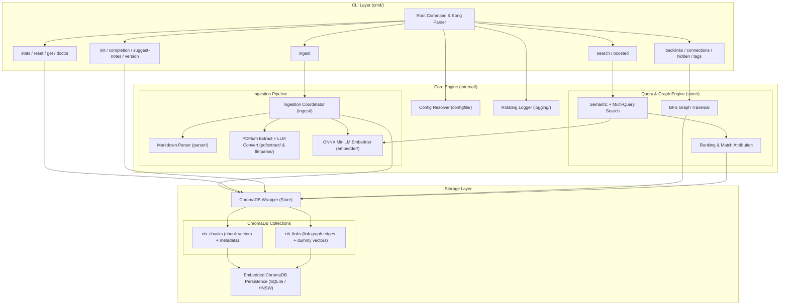

# Architecture and Design

NoteBrain CLI turns an Obsidian vault into a local semantic search engine. It reads the markdown notes of the vault. It creates chunks of text from each note. It embeds each chunk into a vector. The vectors live in an embedded ChromaDB store. This store makes semantic search, graph traversal, and tag search possible and indexes PDF attachments when you enable them.

---

## 1. System Architecture Diagram

This diagram shows the high-level architecture of NoteBrain CLI. It shows the data flow between the CLI layer, the core processing engines, the embedder, and the embedded ChromaDB storage layer.

```mermaid
graph TD
    subgraph CLI ["CLI Layer (cmd/)"]
        Root["Root Command & Kong Parser"]
        CmdIngest["ingest"]
        CmdSearch["search / boosted"]
        CmdGraph["backlinks / connections / hidden / tags"]
        CmdVault["stats / reset / get / doctor"]
        CmdExtra["init / completion / suggest-notes / version"]
    end

    subgraph Core ["Core Engine (internal/)"]
        Config["Config Resolver (configfile/)"]
        Logging["Rotating Logger (logging/)"]

        subgraph IngestionPipeline ["Ingestion Pipeline"]
            Parser["Markdown Parser (parser/)"]
            PDF["PDFium Extract + LLM Convert (pdfextract/ & llmparse/)"]
            Embedder["ONNX MiniLM Embedder (embedder/)"]
            Ingest["Ingestion Coordinator (ingest/)"]
        end

        subgraph QueryEngine ["Query & Graph Engine (store/)"]
            Query["Semantic + Multi-Query Search"]
            Graph["BFS Graph Traversal"]
            Ranking["Ranking & Match Attribution"]
        end
    end

    subgraph Storage ["Storage Layer"]
        ChromaStore["ChromaDB Wrapper (Store)"]

        subgraph Collections ["ChromaDB Collections"]
            NbChunks["nb_chunks (chunk vectors + metadata)"]
            NbLinks["nb_links (link graph edges + dummy vectors)"]
        end

        SQLite["Embedded ChromaDB Persistence (SQLite / HNSW)"]
    end

    Root --> CmdIngest & CmdSearch & CmdGraph & CmdVault & CmdExtra
    Root --> Config
    Root --> Logging

    CmdIngest --> Ingest
    Ingest --> Parser
    Ingest --> PDF
    Ingest --> Embedder
    Ingest --> ChromaStore

    CmdSearch --> Query
    CmdGraph --> Graph
    CmdVault --> ChromaStore
    CmdExtra --> ChromaStore

    Query --> Embedder
    Query --> Ranking
    Graph --> ChromaStore
    Ranking --> ChromaStore

    ChromaStore --> NbChunks & NbLinks
    NbChunks & NbLinks --> SQLite
```

---

## 2. Local Vector Database (ChromaDB)

NoteBrain embeds ChromaDB directly into the Go binary. It uses the `chroma-go` library (module v0.4.1, API package v2). The tool runs with `CGO_ENABLED=1`. The build compiles the SQLite and HNSW bindings into the binary. The vector store writes to disk at `~/.notebrain/chroma`.

The tool needs no Docker container and no HTTP vector server. This keeps the tool offline and fast.

---

## 3. ChromaDB Collections and Schema

ChromaDB separates the data into two collections. The `nb_chunks` collection stores the note content vectors. The `nb_links` collection stores the link graph.

### `nb_chunks` Collection

This collection stores text chunks, their vectors, and their metadata.

| Property              | Value / Setting                                                | Description                                                                              |
| :-------------------- | :------------------------------------------------------------- | :--------------------------------------------------------------------------------------- |
| **Collection Name**   | `nb_chunks`                                                    | The primary collection for note text chunks.                                            |
| **HNSW Space**        | `cosine`                                                       | The cosine distance metric. It matches the MiniLM embeddings.                             |
| **HNSW Index Tuning** | `search_ef=50`, `M=32`, `construction_ef=200`, `num_threads=1` | This tuning prevents hnswlib background thread crashes and isolated node assertion failures. |
| **Document ID**       | `<note_slug>:<chunk_index>`                                    | A unique composite identifier (for example, `my-note:0`).                                |
| **Document Text**     | Markdown string                                                | The rich text of the chunk. The chunk keeps wikilinks and code fences.                   |
| **Embedding Vector**  | `[]float32` (384-dim)                                          | The dense vector from the local ONNX MiniLM model.                                      |

#### Metadata Schema (`nb_chunks`)

Array properties (such as tags) are flattened into numbered keys (`tag_0`, `tag_1`). This flattening keeps compatibility with the Go ChromaDB client. The tool stores at most 20 tags per note.

| Field Name            | Type     | Description                                                                |
| :-------------------- | :------- | :------------------------------------------------------------------------- |
| `note_slug`           | `string` | A slugified identifier for the parent note.                                |
| `title`               | `string` | The title of the note from frontmatter, heading, or filename.              |
| `file_path`           | `string` | The relative path to the markdown file in the vault.                       |
| `chunk_index`         | `int`    | The zero-based index of the chunk in the note.                             |
| `heading_path`        | `string` | The hierarchical heading breadcrumb (for example, `Architecture > Schema`). |
| `heading_level`       | `int`    | The numeric depth of the section heading.                                  |
| `has_task`            | `bool`   | `true` when the chunk contains task checkboxes, `[ ]` or `[x]`.            |
| `has_code`            | `bool`   | `true` when the chunk contains a fenced code block.                        |
| `file_type`           | `string` | The type of file, `md` for markdown or `pdf` for PDF.                      |
| `content_hash`        | `string` | The SHA-256 hash of the file content. The tool uses it for change tracking.|
| `tag_count`           | `int`    | The number of tags on the note.                                            |
| `tag_0`, `tag_1`, ... | `string` | The flat encoding of individual tags (for example, `tag_0: "golang"`).     |

#### Two Text Forms per Chunk

Each chunk has two text forms. The rich form keeps the original markdown. It keeps wikilinks (for example, `[[Target|Alias]]`) and code fences. Commands such as `notebrain get` show this form.

The embedding text is the plain form. Image embeds become `[image]`. Other attachments become `[attachment]`. Code blocks become `[code]`. A text label stays in the marker (for example, `[image: Architecture diagram]`). Size suffixes (for example, `|200x150`) do not appear.

This keeps image noise out of the vectors. The embedder reads a mix of the note title, the heading path, and the plain text.

### `nb_links` Collection

This collection stores directed edges. These edges represent wikilinks between notes (`source_slug` -> `target_slug`). ChromaDB requires uniform vector dimensions and non-empty documents for all collections. Because of this requirement, this collection stores dummy vectors.

| Property              | Value / Setting               | Description                                                                                                            |
| :-------------------- | :---------------------------- | :--------------------------------------------------------------------------------------------------------------------- |
| **Collection Name**   | `nb_links`                    | The metadata-only collection that represents the note link graph.                                                      |
| **HNSW Space**        | `l2`                          | The Euclidean distance. L2 space prevents cosine degeneracy on random vectors.                                         |
| **HNSW Index Tuning** | `num_threads=1`               | Single-threaded index operations for stability.                                                                        |
| **Document ID**       | `<source_slug>→<target_slug>` | A unique directed edge identifier (for example, `index→architecture`).                                                 |
| **Document Text**     | `string`                      | The raw link path. This is `"-"` when it is empty.                                                                     |
| **Embedding Vector**  | `[]float32` (16-dim)          | A dummy 16-dimensional vector in L2 space. The tool seeds it from the slug pair with FNV-32a.                           |

#### Metadata Schema (`nb_links`)

| Field Name | Type | Description |
| :--- | :--- | :--- |
| `source_slug` | `string` | The slug of the source note where the link starts. |
| `target_slug` | `string` | The canonical slug of the target note. The tool strips `#anchor` headings at write time. |
| `target_path` | `string` | The raw link text or path from the Markdown source. |
| `display_text` | `string` | The display alias of the link (for example, `[[Target|Alias]]` -> `Alias`). |

> [!NOTE]
> **Why does NoteBrain use dummy vectors for links?**
>
> ChromaDB is a vector database. It does not support vectorless document collections. Every stored document requires a vector. NoteBrain stores the graph edges as metadata in `nb_links`. This represents the wikilink graph without a second database.
>
> * **Prevention of HNSW index collapse:** Flat zero vectors make distance collapse to zero. This causes C++ crashes or infinite loops.
> * **Random vectors in L2 space:** A 16-dimensional random vector keeps the index mathematically stable. The tool never queries these vectors. All graph traversals filter only on metadata in Go memory.

---

## 4. Subsystems and Components

- **CLI Layer (`cmd/`)**: Kong builds this layer for command-line parsing and flag resolution. The CLI supports a strict hierarchy. CLI flags override the TOML configuration file (`~/.notebrain/config/config.toml`). The configuration file overrides the defaults.
- **Configuration (`internal/configfile`)**: This subsystem loads the TOML configuration with Kong resolvers. Key names are case-insensitive. The names `snake_case` and `kebab-case` match the same key.
- **Embedder (`internal/embedder`)**: This subsystem runs the local embedding model. It uses the ONNX Runtime with the `all-MiniLM-L6-v2` model. The model produces 384-dimensional vectors.
- **Parser (`internal/parser`)**: This subsystem reads Markdown files from the vault. It extracts YAML frontmatter and properties. It parses wikilinks and standard links. It identifies task checkboxes and tables. It splits note text into semantic chunks by heading. It preserves structural Markdown across chunk boundaries. This structure includes lists, task checkboxes, blockquotes, callouts, and tables. Code blocks never split across chunks.
- **PDF Extraction (`internal/pdfextract`)**: This subsystem extracts text from PDFs with a WASM-compiled PDFium backend. It uses a pool of worker instances.
- **LLM Conversion (`internal/llmparse`)**: This subsystem converts the raw PDF text into structured Markdown. It calls an LLM API (DeepSeek, OpenRouter, OpenAI, Gemini, or Ollama). The converted Markdown shares the same chunk layout as markdown notes.
- **Ingest (`internal/ingest`)**: This subsystem coordinates the ingestion pipeline. It walks the vault. It parses files. It generates embeddings. It skips unchanged files by content hash. It applies one atomic batch update to the store.
- **Store (`internal/store`)**: This is the ChromaDB wrapper. It abstracts collection creation, chunk upsert, and link deduplication. It exposes all graph and semantic queries.
- **Logging (`internal/logging`)**: This subsystem writes log records to a rotating file. The default file size limit is 10 MiB. The tool keeps 5 backups. A mutex makes the writer safe for concurrent writes.

---

## 5. Key Architectural Decisions

1. **Embedded persistent storage only**: NoteBrain embeds ChromaDB in persistent mode (`CGO_ENABLED=1`). This removes the need for a separate vector database server.
2. **Atomic ingestion under mutex**: The store executes all note updates under one write lock. The sequence is `DeleteNoteChunks` -> `UpsertChunks` -> `UpsertLinks`. This prevents concurrent HNSW modifications. Concurrent modifications can cause hnswlib assertion crashes.
3. **In-memory graph traversal**: The tool executes graph algorithms (BFS for connections, backlinks, and hidden checks) in Go memory. The data comes from `nb_links` metadata. The tool does not need a graph database.
4. **Flat tag encoding**: The tool flattens array metadata into `tag_0` to `tag_19`. This keeps ChromaDB compatible with the Go client binding. The tag limit is 20 per note.
5. **Dummy 16-dimensional vectors for edges**: ChromaDB requires non-empty vectors. The `nb_links` collection uses 16-dimensional vectors in L2 space. The tool seeds each vector from the slug pair with FNV-32a. This reproduces identical vectors on re-ingest and prevents HNSW churn.
6. **Cached link resolver**: The tool builds a slug-to-slug resolver once per store lifetime. Graph commands reuse it instead of scanning the vault per command. `BatchIngest` rebuilds the resolver after each batch. `Reset` invalidates it.
7. **Single-scan exclude resolution**: The `--exclude-notes` filter resolves all exclusions in one metadata scan. It also verifies the existence of each excluded note for the typo warning.
8. **Batch shared-tag search**: The `tags --shared` command runs one union scan over the seed tags. It accumulates per-note counts in Go. A per-tag scan costs one full vault walk per tag.
9. **FFI-safe pagination**: The embedded ChromaDB FFI caps responses at 1 MiB. The tool pages metadata fetches at 200 records. It caps semantic fetch limits at 100 results. A limit above 100 triggers a warning and truncation.
10. **TTY-aware output styling**: Text output uses ANSI colors only on an interactive terminal. The tool disables colors when `NO_COLOR` is set, when `TERM=dumb`, or when stdout is piped. Piped output stays machine-clean. The `[PDF]` tag renders in blue.

---

## 6. FFI Safety Limits

The embedded ChromaDB client uses a foreign function interface (FFI). The FFI caps each response at 1 MiB. A chunk with metadata is about 500-800 bytes. The tool defines two safety limits.

| Limit | Value | Where it applies |
| :--- | :--- | :--- |
| `ffiSafePageSize` | 200 | Metadata, ID, and document fetches (paginated `Get` calls). |
| `ffiSafeSemanticLimit` | 100 | `Query()` result count for semantic search. |

The tool warns once when a user limit exceeds a cap. Internal fetch multipliers use `min()` instead. This avoids spurious warnings per query.

---

## 7. AI Agent Integration and Optimization

NoteBrain serves as a fast, local knowledge retriever for autonomous AI agents. The following query features optimize agent efficiency, token usage, and search accuracy.

### 1. `--context-window` (Sliding Semantic Context)

Standard vector databases return isolated chunks with the highest score. Chunking often splits and loses surrounding sentences. This loss limits the reasoning of an AI agent.

- **How it operates**: The tool fetches `N` adjacent chunks before and `N` adjacent chunks after each match in the same note. It queries all chunks for the note slug. It sorts them by `chunk_index`. Then it keeps the window range `[chunk_index - N, chunk_index + N]`.
- This provides the surrounding context without reading the whole note. It keeps a token-efficient context window.

### 2. `--include-text` (Direct One-Step RAG Extraction)

Semantic searches return metadata-only results by default. This default optimizes throughput.

- **How it operates**: The `--include-text` flag tells NoteBrain to pull the raw document content from the store. The tool puts this content in the `text` field of the JSON or TSV output.
- This enables one-step Retrieval-Augmented Generation (RAG). The agent issues one command and receives the references and the content together.

### 3. `--top-k` (Chunk Diversity and Note De-duplication)

A vector search on large files has a common failure mode. One note with many relevant paragraphs can fill the result set. This removes other relevant notes.

- **How it operates**: The `--top-k` flag sets the maximum number of chunks that one query returns from the same note.
- The agent receives a diverse set of results from multiple notes. This prevents the LLM from staying inside one document.

### 4. Multi-Query Positional Arguments and Multi-Hit Boosting

Separate search commands add overhead for agents. Separate searches do not highlight bridging concepts across topics.

- **How it operates**: Multiple positional query arguments instruct NoteBrain to embed all query terms at once. The tool retrieves candidates independently for each query vector.
- **Multi-hit boosting**: The tool merges the results with a two-tier ranking strategy. The primary sort is the number of matched query topics, descending. The secondary sort is the maximum similarity score, descending. This shows concepts that bridge orthogonal domains.
- **Hit attribution**: In JSON or TSV output, each item includes a `matched_queries` array. In text mode, the tool shows hit tags (for example, `[hits: "redis", "message broker"]`).

For the exact ranking rules of `search` and `hidden --deep`, read the [Ranking](Ranking.md) document.
