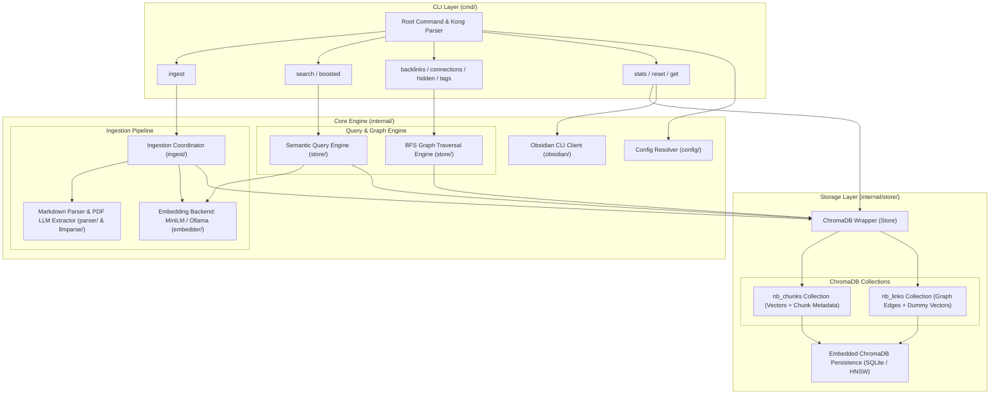

# Architecture and Design

NoteBrain CLI processes the markdown vault of Obsidian. It makes a semantic knowledge engine that you can search. It puts the markdown notes into an embedded vector store (ChromaDB). This vector store makes possible semantic search, backlink traversal, graph connections, hidden connections, shared tags discovery, and graph-boosted hybrid search.

---

## 1. System Architecture Diagram

This diagram shows the high-level architecture of NoteBrain CLI. It shows the data flow between the CLI layer, core processing engines, embedding providers, and the embedded ChromaDB storage layer.

```mermaid
graph TD
    subgraph CLI ["CLI Layer (cmd/)"]
        Root["Root Command & Kong Parser"]
        CmdIngest["ingest"]
        CmdSearch["search / boosted"]
        CmdGraph["backlinks / connections / hidden / tags"]
        CmdVault["stats / reset / get"]
    end

    subgraph Core ["Core Engine (internal/)"]
        Config["Config Resolver (config/)"]
        Obsidian["Obsidian CLI Client (obsidian/)"]

        subgraph IngestionPipeline ["Ingestion Pipeline"]
            Parser["Markdown Parser & PDF LLM Extractor (parser/ & llmparse/)"]
            Embedder["Embedding Backend: MiniLM / Ollama (embedder/)"]
            Ingest["Ingestion Coordinator (ingest/)"]
        end

        subgraph QueryEngine ["Query & Graph Engine"]
            Query["Semantic Query Engine (store/)"]
            Graph["BFS Graph Traversal Engine (store/)"]
        end
    end

    subgraph Storage ["Storage Layer (internal/store/)"]
        ChromaStore["ChromaDB Wrapper (Store)"]

        subgraph Collections ["ChromaDB Collections"]
            NbChunks["nb_chunks Collection (Vectors + Chunk Metadata)"]
            NbLinks["nb_links Collection (Graph Edges + Dummy Vectors)"]
        end

        SQLite["Embedded ChromaDB Persistence (SQLite / HNSW)"]
    end

    Root --> CmdIngest & CmdSearch & CmdGraph & CmdVault
    Root --> Config

    CmdIngest --> Ingest
    Ingest --> Parser
    Ingest --> Embedder
    Ingest --> ChromaStore

    CmdSearch --> Query
    CmdGraph --> Graph
    CmdVault --> ChromaStore & Obsidian

    Query --> Embedder
    Query --> ChromaStore
    Graph --> ChromaStore

    ChromaStore --> NbChunks & NbLinks
    NbChunks & NbLinks --> SQLite
```

---

## 2. Local Vector Database (ChromaDB)

NoteBrain embeds ChromaDB directly into the Go binary. It uses `chroma-go` v2. NoteBrain runs embedded in the local process (`CGO_ENABLED=1`). The tool compiles the bindings for SQLite and HNSW directly. The vector storage flushes synchronously to the disk at `~/.notebrain/chroma`.

---

## 3. ChromaDB Collections and Schema

ChromaDB separates the data into two primary collections. The `nb_chunks` collection is for content vector search. The `nb_links` collection is for graph structure.

### `nb_chunks` Collection

This collection stores chunks of note content. It also stores their vector embeddings and comprehensive structural metadata.

| Property              | Value / Setting                                                | Description                                                                              |
| :-------------------- | :------------------------------------------------------------- | :--------------------------------------------------------------------------------------- |
| **Collection Name**   | `nb_chunks`                                                    | The primary collection for note text chunks.                                                 |
| **HNSW Space**        | `cosine`                                                       | The cosine distance metric that optimizes semantic text embeddings.                           |
| **HNSW Index Tuning** | `search_ef=50`, `M=32`, `construction_ef=200`, `num_threads=1` | This tuning prevents hnswlib background thread crashes and isolated node assertion failures. |
| **Document ID**       | `<note_slug>:<chunk_index>`                                    | A unique composite identifier (for example, `my-note:0`, `my-note:1`).                                    |
| **Document Text**     | Markdown string                                                | The raw text content of the markdown chunk.                                              |
| **Embedding Vector**  | `[]float32`                                                    | The dense embedding vector from local MiniLM or Ollama models.                       |

#### Metadata Schema (`nb_chunks`)

Array properties (such as tags) are flattened into numbered keys (`tag_0`, `tag_1`). This flattening maintains strict compatibility with the Go ChromaDB client.

| Field Name            | Type     | Description                                                                |
| :-------------------- | :------- | :------------------------------------------------------------------------- |
| `note_slug`           | `string` | A slugified identifier for the parent note.                                   |
| `title`               | `string` | The title of the note from frontmatter, heading, or filename.                  |
| `file_path`           | `string` | The relative path to the markdown file in the vault.                       |
| `chunk_index`         | `int`    | The zero-based index of the chunk in the note.                             |
| `word_count`          | `int`    | The number of whitespace-separated words in the chunk.                         |
| `has_links`           | `bool`   | `true` when the chunk contains internal wikilinks or external links.         |
| `heading_path`        | `string` | The hierarchical heading breadcrumb (for example, `# Architecture > ## Schema`).      |
| `heading_level`       | `int`    | The numeric depth level of the current section heading.                        |
| `has_table`           | `bool`   | `true` when the chunk contains Markdown tables.                              |
| `has_task`            | `bool`   | `true` when the chunk contains task checkboxes, `[ ]` or `[x]`.             |
| `code_blocks`         | `int`    | The total count of fenced code blocks in the chunk.                        |
| `has_code`            | `bool`   | `true` when `code_blocks > 0`.                                               |
| `modified_ms`         | `int`    | The last modification timestamp of the file in epoch milliseconds.                    |
| `content_hash`        | `string` | The hash of the chunk content for deduplication and change tracking.      |
| `tag_count`           | `int`    | The total number of tags for the note or chunk.                       |
| `tag_0`, `tag_1`, ... | `string` | The flat encoding of individual tags (for example, `tag_0: "golang"`, `tag_1: "ai"`). |
| `file_type`           | `string` | The type of file, `md` for markdown or `pdf` for PDF.                           |

---

### `nb_links` Collection

This collection stores directed edges. These edges represent wikilinks and Markdown links between notes (`source_slug` -> `target_slug`). ChromaDB requires uniform vector dimensions and non-empty documents for all collections. Because of this requirement, this collection stores dummy vectors.

| Property              | Value / Setting               | Description                                                                                                            |
| :-------------------- | :---------------------------- | :--------------------------------------------------------------------------------------------------------------------- |
| **Collection Name**   | `nb_links`                    | The metadata-only collection that represents the note link graph.                                                             |
| **HNSW Space**        | `l2`                          | The Euclidean distance. L2 space prevents cosine degeneracy on random vectors.                                              |
| **HNSW Index Tuning** | `num_threads=1`               | Single-threaded index operations for stability.                                                                        |
| **Document ID**       | `<source_slug>→<target_slug>` | A unique directed edge identifier (for example, `index→architecture`).                                                                  |
| **Document Text**     | `string`                      | The link path or string. This is `"-"` when it is empty.                                                                              |
| **Embedding Vector**  | `[]float32` (16-dim)          | A dummy 16-dimensional random vector in L2 space. This satisfies ChromaDB requirements without HNSW index degeneracy. |

#### Metadata Schema (`nb_links`)

| Field Name | Type | Description |
| :--- | :--- | :--- |
| `source_slug` | `string` | The slugified identifier of the source note where the link starts. |
| `target_slug` | `string` | The canonicalized slug identifier of the target note. This identifier strips `#anchor` headings and resolves exact vault paths via `buildLinkTargetResolver`. |
| `target_path` | `string` | The raw link text or path from the Markdown source. |
| `display_text` | `string` | The display alias or text of the link (for example, `[[Target|Alias]]` -> `Alias`). |

> [!NOTE]
> **Why does NoteBrain use dummy vectors for links?**
> 
> ChromaDB is a vector database. It does not support standard relational tables or vectorless document collections. Every stored document requires a vector embedding. NoteBrain stores directed edges as metadata in the `nb_links` collection. This represents Wikilink graph edges without a second database technology.
> 
> *   **Prevention of HNSW Index Collapse:** The HNSW index degenerates if NoteBrain uses flat zero-vectors (for example, `[0, 0, ..., 0]`) for all links. Distance calculations collapse to zero for identical vectors. This causes C++ crashes or infinite loops.
> *   **Random Vectors in L2 Space:** NoteBrain generates a 16-dimensional random vector in L2 (Euclidean) space for each link. This configuration keeps the index mathematically stable. NoteBrain does not query these vectors. All graph traversals filter only on metadata fields in Go memory.

---

## 4. Subsystems and Components

- **CLI Layer (`cmd/`)**: Kong builds this layer for command-line parsing and flag resolution. The CLI layer supports a strict two-tier configuration hierarchy. CLI flags override the TOML configuration file (`~/.notebrain/config/config.toml`).
- **Configuration (`internal/configfile` and `config/`)**: This subsystem manages the loading of TOML configuration via Kong resolvers. It supports normalized key lookups (`snake_case` and `kebab-case`). It resolves flags without `.env` files or application environment variables.
- **Embedder (`internal/embedder`)**: This subsystem manages the local embedding models. It supports embedded ONNX MiniLM sentence embeddings or external Ollama service backends.
- **Parser (`internal/parser`)**: This subsystem reads Markdown files from the Obsidian vault. It extracts YAML frontmatter and properties. It parses wikilinks and standard Markdown links. It identifies task checkboxes and tables. It splits note text into semantic chunks. It preserves structural Markdown syntax across chunks. This syntax includes tight lists (`1. `, `- `), task checkboxes (`[ ] `, `[x] `), blockquotes, callout headers (`> [!NOTE]`), and tables. Distinct structural blocks are cleanly separated by `\n\n`.
- **PDF Extractor (`internal/pdfextract` and `internal/llmparse`)**: This subsystem extracts text from PDFs. It uses a WASM-compiled PDFium backend. The system sends the raw text to an LLM API via `llmparse`. This converts the text into structured markdown. This process guarantees that PDF chunks share the same layout as markdown notes.
- **Ingest (`internal/ingest`)**: This subsystem handles multi-worker concurrent directory walking. It reads `.md` and `.pdf` files. It calls the parser and extractor. It generates embeddings. It coordinates atomic note updates under a single store mutex lock.
- **Store (`internal/store`)**: This is the ChromaDB wrapper. It abstracts collection creation, chunk upsertion, and link deduplication. It exposes all graph and semantic queries.
- **Obsidian Client (`internal/obsidian`)**: This client interacts with the Obsidian CLI for vault operations and note inspection.

---

## 5. Key Architectural Decisions

1. **Embedded Persistent Storage Only**: NoteBrain strictly embeds ChromaDB in persistent mode (`CGO_ENABLED=1`). This configuration removes the need for a separate Docker container or HTTP vector database server.
2. **Atomic Ingestion Under Mutex**: The system executes all note updates under a write lock. The sequence is `DeleteNoteChunks` -> `UpsertChunks` -> `UpsertLinks`. This prevents concurrent HNSW graph modifications. Concurrent modifications can cause hnswlib assertion crashes.
3. **In-Memory Graph Traversal**: The system executes graph algorithms (BFS for connections, backlinks, and hidden links) in Go memory. The data comes from `nb_links` metadata. NoteBrain does not use complex SQL queries or a dedicated graph database.
4. **Flat Tag Encoding**: The system flattens array metadata (`tag_0`, `tag_1`). This encoding makes sure that ChromaDB has robust compatibility with the Go client binding.
5. **Dummy 16-Dimensional Vectors for Edges**: ChromaDB requires uniform dimensions and non-empty vectors. Because of this, `nb_links` uses 16-dimensional random float vectors in L2 space. The 16 distinct dimensions prevent HNSW failure or corruption on identical vector spaces.

---

## 6. AI Agent Integration and Optimization

NoteBrain serves as a fast, local knowledge retriever for autonomous AI agents. The following four query features optimize agent efficiency, token usage, and search accuracy.

### 1. `--context-window` (Sliding Semantic Context)

Standard vector databases return isolated text chunks that have the highest similarity score. The chunking of note text often splits and loses surrounding contextual sentences. This loss limits the reasoning capacity of an AI agent.

- **How it operates**: NoteBrain retrieves the matched chunk when `--context-window=N` is enabled. It dynamically fetches `N` adjacent chunks before and `N` adjacent chunks after the match in the same note. It queries all chunks for the note slug. It sorts them in memory by their `chunk_index`. Then it filters the results for the window range `[chunk_index - N, chunk_index + N]`.
- This provides the surrounding context for the agent. The agent does not read the entire note. This process increases reasoning precision. It keeps a token-efficient context window.

### 2. `--include-text` (Direct One-Step RAG Extraction)

Semantic searches in NoteBrain return metadata-only results by default. This default optimizes network and database throughput.

- **How it operates**: The `--include-text` flag tells NoteBrain to pull the raw document content from the persistent store of ChromaDB. NoteBrain puts this content in the `text` field of the structured output (JSON or TSV).
- This flag enables one-step Retrieval-Augmented Generation (RAG). The agent can issue a single command. The agent receives the note references and the content text from the returned stream. The agent avoids the latency of separate `get` commands or file-read operations.

### 3. `--top-k` (Chunk Diversity and Note De-duplication)

A vector search on large files has a common failure mode. One note with many highly relevant paragraphs can fill the query result set. This failure removes other relevant notes from the results.

- **How it operates**: The `--top-k` flag (or `TopKPerNote`) sets a limit. This limit is the maximum number of chunks that a query returns from the same note.
- The agent receives a diverse set of search results from multiple notes when you set `--top-k`. This limit prevents the LLM from being trapped in the context of one document. It gives a broad and balanced view of the knowledge base.

### 4. Multi-Query Positional Arguments and Multi-Hit Boosting

Multiple separate search commands add overhead for AI agents when they research complex topics. Separate searches do not highlight bridging concepts across topics.

- **How it operates**: Multiple positional query arguments instruct NoteBrain to embed all query terms simultaneously. NoteBrain uses `emb.EmbedBatch` for this operation. The system retrieves candidates independently for each query vector across ChromaDB. The system uses semantic vector similarity (cosine distance).
- **Multi-Hit Boosting**: The system merges and sorts the results with a two-tier ranking strategy:
  1. **Primary Sort (Hit Count)**: Chunks that match multiple query topics move to the top of the rankings. They are higher than single-topic matches. A single-topic match can have a higher similarity score, but the multiple query match still wins. This sorting surfaces concepts that bridge orthogonal domains.
  2. **Secondary Sort (Score)**: Within each hit-count tier, the system orders the results by their maximum cosine similarity score descending.
- **Hit Attribution**: In structured outputs (JSON or TSV), each item includes a `matched_queries` array. This array shows the query vectors that retrieved the item. In text mode, the system shows hit tags (for example, `[hits: "redis", "message broker"]`).
