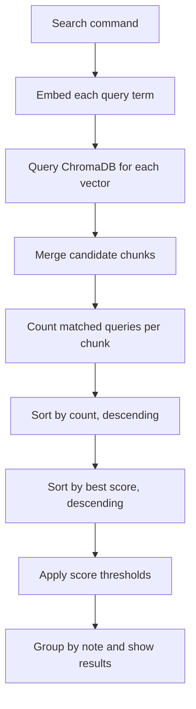
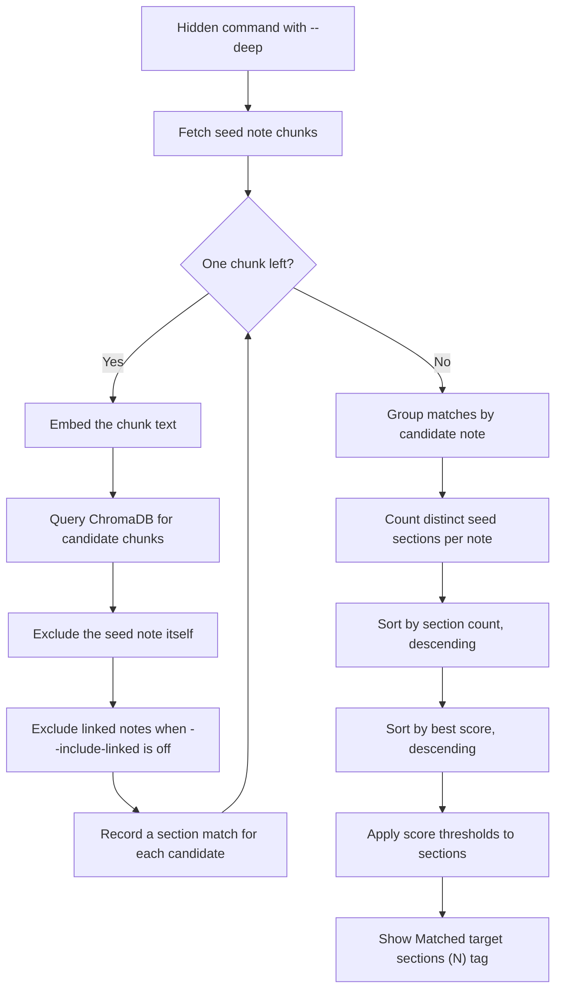
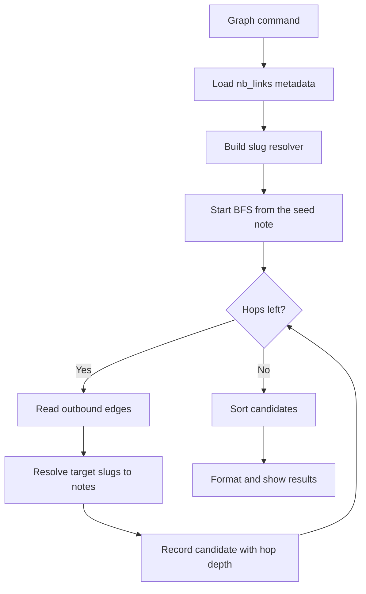

# Ranking

This document explains how NoteBrain ranks the results of a query. It covers the semantic search ranking, the score thresholds, and the `hidden --deep` algorithm. It also covers the graph traversal ranking for `connections`, `backlinks`, and `tags --shared`.

The [Architecture](Architecture.md) document describes the storage layer and the metadata schema. The [Commands](Commands.md) document describes each command and its flags.

---

## 1. Semantic Search Ranking

The `search` command and the `boosted` command use a two-tier ranking. The ranking merges results from multiple query topics.

1. Primary sort key: the count of matched query topics, descending.
2. Secondary sort key: the best similarity score, descending.

A result that matches two topics ranks above a result that matches one topic with a higher score.

### Multi-Query Flow

### Score Thresholds

The tool applies score thresholds to remove weak matches. The function is `filterMatchedQueries`.

The rules are:

1. A chunk stays when its score is at least 0.70 (the absolute threshold).
2. A chunk stays when its score is at least 0.85 times the best score in the batch (the relative margin).
3. When the best score is below 0.70, the tool keeps chunks within 0.05 of the best score (the fallback delta).

The tool does not sort the filtered chunks again. The filtered chunks keep their original rank order.

---

## 2. Hidden `--deep` Ranking

The `--deep` mode searches for notes that match individual sections of the seed note. It does not compare whole-note embeddings. It ranks candidates by the breadth of section overlap.

### Hidden `--deep` Flow

### The Section Match

A section is a chunk of the seed note. The seed note has a heading path for each chunk. A candidate note matches a seed section when its chunk passes the score thresholds.

The tool counts each distinct seed section once per candidate. A candidate that matches 5 seed sections ranks above a candidate that matches 2 sections.

### The Display Threshold

The tool applies the score thresholds to each section. A section passes when it meets the absolute threshold or the relative margin. The rules are the same as for semantic search (0.70, 0.85, 0.05).

The `Matched target sections (N)` tag shows the count of sections that passed the thresholds. The shown count can be lower than the total matched count. A weak match produces a shown count of 1, even when many sections matched.

### Internal Fetch Limits

The `--deep` mode uses internal fetch limits. These limits cap the ChromaDB query size. They protect the FFI from oversized responses.

| Name | Value | Description |
| :--- | :--- | :--- |
| `fetchLimit` | `min(max(limit*2, 20), 100)` | The chunk fetch cap per seed chunk. |
| `fetchTopK` | `max(topKPerNote*2, 6)` | The query result cap per seed chunk. |
| `headroom` | `min(max(limit*2, limit*topKPerNote, 15), 100)` | The extra capacity for candidate notes beyond the display limit. |

---

## 3. Graph Traversal Ranking

The graph commands traverse the `nb_links` collection. The traversal runs in Go memory. It uses the resolver cache and the link metadata.

### BFS Traversal Flow

### Ranking by Command

| Command | Primary Sort | Secondary Sort | Notes |
| :--- | :--- | :--- | :--- |
| `connections` | Hop depth (closest first) | Note title, ascending | A note appears once at its shortest distance. |
| `backlinks` | Constant score 1.0 | Note title, ascending | Each backlink note carries the score 1.0. |
| `tags --shared` | Shared tag count, descending | Note title, ascending | The count is the number of overlapping tags. |
| `boosted` | Boosted score, descending | Note title, ascending | The boost factor multiplies the base score. |

The `connections` command stops the BFS at the hop limit. The default limit is 2 hops. The `backlinks` command reads only the inbound edges of the seed note. It does not traverse.

---

## 4. Related Documents

- [Architecture](Architecture.md): the storage layer, the collections, and the metadata schema.
- [Commands](Commands.md): the command-line interface and the flag reference.
